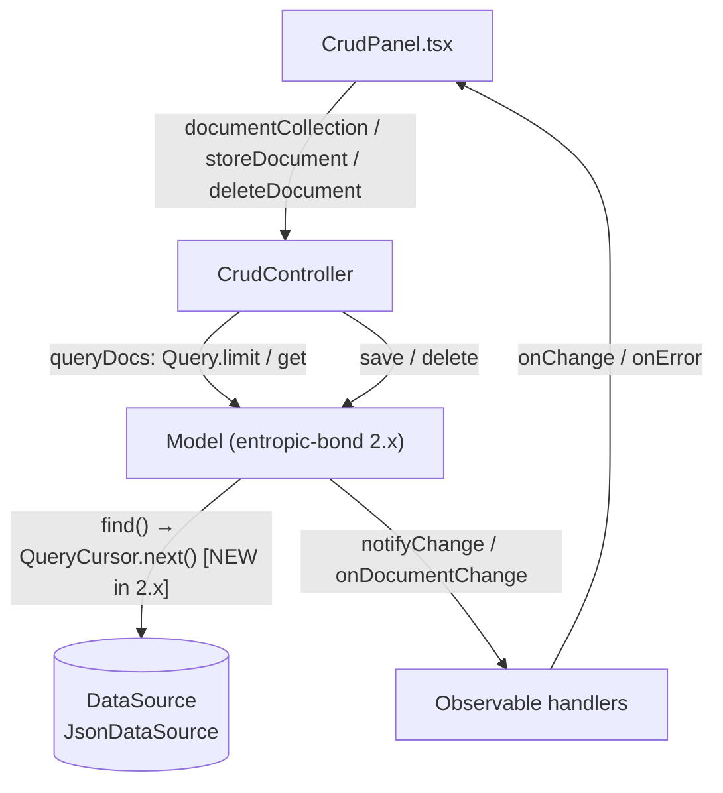

# Design — bump entropic-bond to 2.x (`bump-eb-crud-panel`)

Spec: [dependency-migration.feature](./dependency-migration.feature) (`[REQ-1..6]`)

## Abstract

A dependency-major migration, not a feature: `entropic-bond` moves from `^1.59.5`
(locked 1.59.5) to `^2.0.4` (locked 2.0.4). Upstream 2.0.0 breaking change:
`DataSource.find()` resolves a `QueryCursor` and `DataSource.next()` was removed;
callers paginate through `cursor.next()`. `crud-panel` ships **no custom
`DataSource` adapter** (it consumes `Model`/`Query` only), so no production source
change is required — the migration risk sits in the observable paths whose
upstream implementation changed:

1. `CrudController.documentCollection( limit )` → `Query.limit( n ).get()` → now
   routed through `Model.query()` → `QueryCursor.next()` (limit applied by the
   cursor instead of `Array.slice` inside `JsonDataSource.find`).
2. `storeDocument()` / `deleteDocument()` → `Model.save()` / `Model.delete()`
   (JsonDataSource delete semantics were aligned with Firebase in 1.61.0).
3. Error propagation from `find`/`save`/`delete` through `onError` / `throwOnError`.

## Seams and data flow

## Plan

1. Bump `entropic-bond` to `^2.0.4` in `package.json`, let npm rewrite
   `package-lock.json` (only `entropic-bond` and its own required transitive
   `uuid ^14.0.2` may move).
2. Verify the migration-sensitive paths with tests first (TDD, `[REQ-1..6]`):
   - manifest/resolution test (`[REQ-1]`),
   - collection retrieval, limit-under-cursor, `saved`/`deleted` notifications and
     error propagation (`[REQ-2..6]`) added to `src/crud-controller.spec.ts`.
3. Adapt `src/` **only if** a scenario fails (none expected; upstream kept the
   `Model`/`Query` surface source-compatible for this package).
4. Gates (not `[REQ-n]`, per `testing` skill checklist): full `npm test`,
   `tsc` typecheck of `src/` including specs, `npm run build`.

## Proposed changes

| File | Change |
| --- | --- |
| `package.json` | `entropic-bond`: `^1.59.5` → `^2.0.4` |
| `package-lock.json` | resolve `entropic-bond@2.0.4`; transitive `uuid@14.0.2` (required by entropic-bond itself) |
| `src/crud-controller.spec.ts` | new describe block: `[REQ-2..6]` regression scenarios |
| `src/entropic-bond-dependency.spec.ts` | new: `[REQ-1]` manifest/resolution scenario |
| `src/*.ts(x)` (production) | **no changes** — verified against 2.x types and runtime |

Explicitly out of scope: "do not bump any other dependency" is a PR-scope
constraint, verified by reviewing the `package-lock.json` diff (only
`entropic-bond` + its own `uuid` range), not encoded as a lasting `[REQ-n]`
(it would break on any future legitimate bump). Compilation against 2.x types is
a CI gate (`npm run build`), not a runtime-observable `[REQ-n]`.

## Best practices and decisions

- **Tests-first regression guards**: every upstream-changed path crud-panel can
  reach gets a scenario; the previously untested `limit` path (`[REQ-3]`) is the
  one the 2.x cursor rewrite directly touches.
- **No speculative refactoring**: production code untouched when the suite is
  green — a major-bump PR should not mix unrelated changes.
- **Single source of truth**: `[REQ-1]` derives the expected version from the
  declared range in `package.json` instead of hardcoding it twice.

Strengths: minimal diff, every migration-sensitive path pinned by a named
scenario. Weaknesses: `[REQ-3..5]` exercise the `JsonDataSource` in-memory
adapter, not a remote backend — remote adapters are out of this package's scope.

## Audit note (code-auditor, step 2 — no major improvements detected)

Objective audit of the migration diff (feature file + `package.json` /
`package-lock.json`, production `src/` untouched) found no architecture-level
friction introduced. Verdict: **approve**; no **Strong** recommendations. Less
valuable improvements, all pre-existing and out of this PR's scope:

- `crud-panel.spec.tsx` imports `crud-controller.spec`, so every controller
  scenario executes twice per suite run (double runtime of the delay-based
  tests). Worth extracting the shared fixtures (`Test`, `TestController`,
  `mockData`) into a non-spec module.
- `documentCollection()` notifies `documentCollection: []` in its `finally` even
  on the error path, in addition to the error event — consumers must ignore the
  empty collection when an error was notified (**Speculative**).
- `findDocs()` returns `undefined` as a sentinel to fall back to `queryDocs()`;
  an explicit discriminated result would be a deeper seam (**Worth exploring**).
